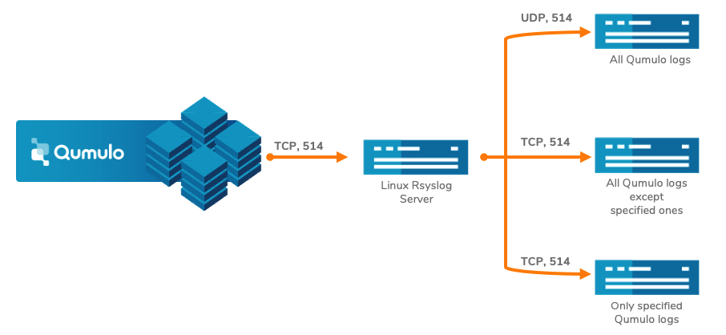

# Log Filtering and Forward for Qumulo Audit Logs

## Introduction

This script generates a rsyslog configuration file for filtering and forwarding Qumulo audit logs to the other systems.




## Table of Contents

   * [Introduction](#introduction)
   * [Requirements](#requirements)
   * [Why Filter and Forward?](#why-filter-and-forward)
   * [Why would I use UDP for rsyslog data?](#why-would-i-use-udp-for-rsyslog-data)
   * [Qumulo Log Field Definitions](#qumulo-log-field-definitions)
   * [Getting Started](#getting-started)
   * [Configuration with rsyslog](#configuration-with-rsyslog)
   * [Configure Logrotate](#configure-logrotate)
   * [Define Parameters and Run LogFilter Script](#define-parameters-and-run-logfilter-script)
   * [JSON File Examples](#json-file-examples)
   * [Additional Documentation](#additional-documentation)
   * [Help](#help)
   * [Copyright](#copyright)
   * [License](#license)
   * [Trademarks](#trademarks)
   * [Contributors](#contributors)

## Requirements
-   A Linux machine with Rsyslog

## Why Filter and Forward?

There are several reasons why you may wish to filter and forward your Qumulo audit logs.

1. You wish to aggregate all of your logs onto one machine. This is known as log aggregation.
2. There is a requirement to filter specific logs for better understanding.
3. Qumulo only uses TCP as the delivery mechanism for rsyslog, but your application requires UDP.

## Why would I use UDP for rsyslog data?

The rsyslogd daemon was originally configured to use UDP for log forwarding to reduce overhead. While UDP
is an unreliable protocol, it's streaming method does not require the overhead of establishing a network
session. This protocol also reduces network load as the network stream requires no receipt verification
or window adjustment.

You may find that UDP is preferred if:

1. The receiving device does not support TCP delivery
2. The receiving device, or hosting network, are severely resource limited
3. The logs being delivered are considered low priority

When choosing UDP log delivery, it is important to keep in mind that there is no message delivery
verification or **recovery**. So, while the likelihood of data loss may not be high, logs can be
missed due to network packet loss.

## Qumulo Log Field Definitions

The fields are described below in the order that they display within the Qumulo audit log message body:
```
W.X.Y.Z,groot-1,"AD\alice",smb2,fs_read_data,ok,123,"/Mike/docs/image.png",""
```
Where **W.X.Y.Z** would equal a valid IP address.

The fields within the log file entries are:

**User IP** - The IP address of the user in IPV4/IPV6 format

**Node** - The node in the Qumulo cluster that generated the log entry

**User ID** - The user that performed the action. The user id can be of the form:

- AD username
- Qumulo local username
- POSIX UID
- Windows SID
- Qumulo auth ID (only if Qumulo fails to resolve the user ID to any of the previous types)

**Logins** - Any successful or unsuccessful login attempt by the user for the operation below:

- Session login via the Web UI
- Session login via the qq CLI
- SMB login
- NFS mount
- FTP login

**Protocol** - The protocol that the user request came through

- nfs3
- nfs4
- smb2
- smb3
- ftp
- api

**File System Operation** - The operation that the user attempted

- fs_create_directory
- fs_create_file
- fs_create_hard_link
- fs_create_symlink
- fs_create (a filetype other than the types capture above)
- fs_delete
- fs_fsstat
- fs_read_metadata
- fs_list_directory
- fs_open
- fs_read_data
- fs_read_link
- fs_rename
- fs_write_data
- fs_write_metadata

**Management Operation** - Any operation that modified the cluster configuration

- auth_create_user
- smb_create_share
- smb_login
- nfs_create_export
- nfs_mount
- snapshot_create_snapshot
- replication_create_source_relationship

**Error Status** - "ok" if the operation succeeded or a Qumulo specified error code if the operation failed.

Keep in mind that error status codes are subject to change with new releases of Qumulo Core and may differ
depending on the version you have installed on your cluster

<table>
  <tr>
    <th>**Error Status**</th>
    <th>**Details**</th>
  </tr>
  <tr>
    <td>ok</td>
    <td>The operation was successful.</td>
  </tr>
  <tr>
    <td>fs_no_such_path_error</td>
    <td>The directory portion of the path contains a name that doesn't exist.</td>
  </tr>
  <tr>
    <td>fs_no_space_error</td>
    <td>The file system has no available space. Your cluster is 100% full.</td>
  </tr>
  <tr>
    <td>fs_invalid_file_type_error</td>
    <td>The operation isn't valid for this filetype.</td>
  </tr>
  <tr>
    <td>fs_not_a_file_error</td>
    <td>The operation (e.g. read) is only valid for a file.</td>
  </tr>
  <tr>
    <td>fs_sharing_violation_error</td>
    <td>The file or directory is opened by another party in an exclusive manner.</td>
  </tr>
  <tr>
    <td>fs_no_such_entry_error</td>
    <td>The directory, file, or link does not exist in the file system.</td>
  </tr>
  <tr>
    <td>fs_access_denied_error</td>
    <td>The user does not have access to perform the operation.</td>
  </tr>
  <tr>
    <td>fs_access_perm_not_owner_error</td>
    <td>The user would need superuser or owner access to perform the operation.</td>
  </tr>
  <tr>
    <td>fs_entry_exists_error</td>
    <td>A file system object with the given name already exists.</td>
  </tr>
  <tr>
    <td>fs_directory_not_empty_error</td>
    <td>The directory cannot be removed because it is not empty.</td>
  </tr>
  <tr>
    <td>fs_no_such_inode_error</td>
    <td>The file system object does not exist.</td>
  </tr>
  <tr>
    <td>http_unauthorized_error</td>
    <td>The user does not have access to perform the management operation.</td>
  </tr>
  <tr>
    <td>share_fs_path_doesnt_exist_error</td>
    <td>The directory does not exist on the cluster.</td>
  </tr>
  <tr>
    <td>decode_error</td>
    <td>Invalid json was passed to the API.</td>
  </tr>
</table>

**File id** - The ID of the file that the operation was on

**File path** - The path of the file that the operation was on

When accessing a file through a snapshot, the path is prefixed with a "/.snapshot/<snapshot-directory>";
which is the same path prefix used to access snapshot files via nfs and smb.

**Secondary file path** - Any rename or move operations

**IMPORTANT!!** In order to keep the amount of audit log message to a minimum, similar operations performed
in rapid succession will be de-duplicated. For example, if a user reads the same file 100,000 times in a
minute, only one message corresponding to the first read will be generated.

## Getting Started

Before you can run and create a rsyslog configuration file on your system, you will need to clone this repository on your machine. For that, you will need to have `git` installed on your machine.

Once git is operational, then find or create a directory where you wish to store the contents of the `LogFilter` repository and
clone it to your machine with the command `git clone https://github.com/Qumulo/LogFilter.git`

You will notice that the `git clone` command will create a new directory in your current location call `LogFilter`.

The contents of that directory should look like:
```
-rw-r--r--  1 someone  somegroup  1063 Mar 17 08:24 LICENSE
-rw-r--r--  1 someone  somegroup  6972 Mar 17 08:38 README.md
drwxr-xr-x  4 someone  somegroup   128 Mar 17 08:24 config
drwxr-xr-x  4 someone  somegroup   128 Mar 17 08:24 docs
drwxr-xr-x  4 someone  somegroup   128 Mar 17 08:24 outputs
drwxr-xr-x  4 someone  somegroup   128 Mar 17 08:24 utils
-rwxr-xr-x  1 someone  somegroup   301 Mar 17 08:24 LogFilter
```
Of course, the owner will not be `someone` and the group will not be `somegroup`, but will show you as the owner and the group as whatever group you currently belong to. If in doubt, simply type `id -gn` to see your current group and `id -un` to see your current login id.

You will need to modify the **log_filter.json** file under **config** and then run **LogFilter** file to run in your environment. Let us start with the configurations.

## Configuration with Rsyslog

For the following example, our client will be running Ubuntu 18.04. If you are using a different version of Linux, you may need to search how to configure rsyslog for specifics.

### Global rsyslog configuration

Start by updating the global rsyslog configuration to allow receiving syslog messages over TCP connections.
This is required because the Qumulo Cluster will always use the TCP protocol in order to guarantee delivery.

In the **/etc/rsyslog.conf** file, uncomment the following lines to listen for TCP connections on port 514.
If you choose to use a different port, then also change the port referenced to match your desired
configuration.
```
# provides TCP syslog reception
module(load="imtcp")
input(type="imtcp" port="514")
```

### /var/log/qumulo directory and permissions

The LogFilter depends upon the directory **/var/log/qumulo** existing and having the correct permissions.

Create the directory if it doesn't already exist. 

```
mkdir -p /var/log/qumulo
```

Make sure to apply the correct permissions so that the syslog daemon can write to it.

```
chown syslog.adm /var/log/qumulo
```

In the section [Define Parameters and Run LogFilter Script](#define-parameters-and-run-logfilter-script), you will possibly define more **store** locations for your logs. In the example, you will see that we create a **store** in the directory **/var/log/qumulo/auditlog1/**. If you have defined **store** for your logs, then you will need to create and permission those directories as well.

```
mkdir -p /var/log/qumulo/auditlog1
```

Make sure to apply the correct permissions so that the syslog daemon can write to it.

```
chown syslog.adm /var/log/qumulo/auditlog1
```

### Restart the rsyslog daemon

In order for the new Qumulo Audit Log configuration to be active, you must first restart the
rsyslog daemon on the server.

```
systemctl restart rsyslog
```

## Configure Logrotate

**We definitely recommend that you read this next section IF you have configured any store in your configuration file.**
  
Qumulo Audit Log files are intended to retain information about users and file activities for a
reasonable period of time, but there is no guarantee or means to control the size of those log files.
Linux has the capability through **logrotate** to rotate the log files. If left unchecked, Qumulo Audit
Log files can grow to consume all of the available disk space on the server in which they reside.

To prevent log files from filling up your system completely, the log messages can be rotated, meaning that
when a certain threshold has been reached, the old log file is closed and a new log file is opened.

### What is log rotation?

Log rotate is a process that solves these problems by periodically archiving the current log file and
starting a new one. It renames and optionally compresses the current log files, deletes old log files,
and force the logging system to begin new log files. It usually runs automatically through the _cron_
utility. With log rotation, you can

- start a new log file on a schedule, such as daily, weekly, or monthly
- compress old log files to save disk space
- prune old archives so that you keep a certain number of old logs
- rename old log files with a date stamp so you know where to look for older logs
- run command before or after a set of logs is rotated

### Configuration files of logrotate

On Ubuntu 18.04, the logrotate configuration files are in **/etc/logrotate.conf**,
along with any files in **/etc/logrotate.d**. The main _logrotate.conf_ file specifies any default
settings and system file to be rotated. You should not need to edit or change this file in any way.

### Setting up log rotation for Qumulo Audit Logs

The core of log rotation occurs in individual configuration files in the **/etc/logrotate.d** directory.
The files in this directory are executed once per day when the logrotate process is invoked.

A sample logrotate file for the Qumulo Audit Logs is included in the **logrotate** directory of
this github repo. In that directory, you will find a file called **qumulo**. Simply copy that file
to the **/etc/logrotate.d** directory and, when logrotate next runs, the Qumulo Audit Logs will
be rotated.

The **qumulo** configuration file for logrotate looks like:

```
/var/log/qumulo/*.log {
        daily
        missingok
        notifempty
        rotate 4
        size 50M
        dateext
        dateformat -%Y-%m-%d
        postrotate
             /usr/lib/rsyslog/rsyslog-rotate
        endscript
}
```

The parameters are:

**/var/log/qumulo/*.log** - The directory and files that will be worked on. If you are storing the logs
in multiple directories within **/var/log/qumulo**, then you will need to create multiple entries (see below).

**daily** - How often to examine the Qumulo Audit Logs and determine if they should be rotated. Since,
logrotate only runs once per day, you can only change this value to **weekly** or **monthly**.

**missingok** - Instructs logrotate that it is **ok** to have missing log files.

**notifempty** - Don't rotate files if they are empty.

**rotate 4** - Only rotate and keep 4 files. You can change this to any value that you like.

**size 50M** - Only rotate log files that reach 50MB in size. You might want to make this smaller,
but probably shouldn't make this much larger.

**dateext** - Uses the date as an extension for old log files

**dateformat -%Y-%m-%d** - When rotating the log files, change the file name and append a date of
the format YYYY-mm-dd. So, a log file of **groot-1.log** becomes **groot-1.log.2020-01-15**.

**postrotate** - This is a command to execute up to the **endscript** statement. Because rsyslog
will continue to use the old log files until you inform it that they have changed,
we have used the included linux script **/usr/lib/rsyslog/rsyslog-rotate**; which will send a TERM signal
to rsyslog. This TERM signal will inform rsyslog to switch to a new log file.

```
/var/log/qumulo/auditdelete/*.log {
        daily
        missingok
        notifempty
        rotate 4
        size 50M
        dateext
        dateformat -%Y-%m-%d
        postrotate
             /usr/lib/rsyslog/rsyslog-rotate
        endscript
}

  /var/log/qumulo/auditlog1/*.log {
        daily
        missingok
        notifempty
        rotate 4
        size 50M
        dateext
        dateformat -%Y-%m-%d
        postrotate
             /usr/lib/rsyslog/rsyslog-rotate
        endscript
}
```

## Define Parameters and Run LogFilter Script

In the directory `config`, there is a file called `log_filter.json` that must be modified in order to run the LogFilter script.

This application depends upon the file name `log_filter.json` in the subdirectory `config`. Due to that restriction, this file and the directory it is contained in should not be moved or renamed.

Here is the empty file and, in the following paragraphs, we will describe each field
and their proper values. Multiple definitions can be defined inside the square brackets.

```
[
   {
      "forward":
      {
          "hostname": "",
          "port_type": "",
          "port": ""
      },
      "store":
      {
          "name": "AuditLog1",
          "directory": "/var/log/qumulo/auditlog1"
      },
      "log_details": 
      {
         "client_ips" : [],
         "users" : [],
         "protocols": [],
         "operations": [],
         "results": [],
         "ids": [],
         "file_path_1s": [],
         "file_path_2s": []
      }
   }
]
```
There are three main sections in the configuration file `log_filter.json`. 

1. Forward
  
If you wish to forward your filtered logs to another server for further processing (like Splunk, Elasticsearch, etc), then you would create
a **forward** definition.
  
   - `hostname` - FQDN or IP address of the machine that Qumulo audit logs will be forwarded to.
   - `port_type` - `tcp` or `udp`
   - `port` - Port number.

2. Store

This is only necessary if you wish to store the logs for this particular filter. For instance, perhaps you wish to capture just the deletes
for all of the protocols. You would only need to create a filter for **fs_delete** and a store definition
  
   - `name` -  A unique name used for storing logs on the rsyslog server
   - `directory` - A unique directory used for storing logs on the rsyslog server. If you define multiple filter definitions and you wish to store the logs for each of them, then you would define a separate and **unique** directory for each filter definition.
  
3. Log Details

**IMPORTANT!!** *If you leave any of the below definitions empty, the script will generate a conditional definition for log forwarding to the defined remote host over the TCP or UDP port.*

**IMPORTANT!!** *If you define any of the below definitions, the script will generate a conditional definition for filtering the defined parameters and forwarding them to the remote host. Other logs won't be seen on the remote host*

**IMPORTANT!!** *If you define any of the below definitions with `!` like `!fs_list_directory`, the script will generate a conditional definition for excluding the defined parameters and the other logs will be forwarded to the remote host.*

**IMPORTANT!!** *Multiple parameters can be defined with command seperated inside the square brackets.*

   - `client_ips` - Client ip addresses can be specified for filtering. Example: `"10.0.0.1"`, `"10.0.0.1","10.0.0.2"`.
   - `users` - Users can be specified for filtering. Example: `"user01"` , `"AD\user01"`.
   - `protocols` - Protocols can be specified for filtering. Example: `"nfs3"`,  `"smb3"`,  and `"api"`.
   - `operations` - Operations can be specified for filtering. Example: `"fs_create_file"`, `"smb_login"`.
   - `results` - Results can be specified for filtering. Example: `"ok"`, `"fs_not_a_file_error"`.
   - `ids` - Ids can be specified for filtering. Example: `"10001"`
   - `file_paths_1s` - Original file paths can be specified for filtering. Example: `"/home/user01"`, `"/smb_share1"`.
   - `file_paths_2s` - Secondary file paths can be specified for filtering. Example: `"/home/user01"`, `"/smb_share1"` 

Please [Qumulo audit log details](#log-field-definitions) section for more details about the log structure.

Please don't touch other files inside the **config** directory.

### JSON File Examples

We have included three examples of configuration files that perform different types of filtering. These should help you understand how to configure rsyslog to filter and forward different log messages based upon users, protocols, protocol `operations`, etc.
  
1. Log forwarding to another machine without any filter

If you leave the **log details** parameters empty, this indicates you do not wish to define any filters on the Qumulo logs and are only going to forward the Qumulo audit logs to another machine with either TCP or UDP. In the following example, we wish to only forward the audit logs to another host with the UDP protocol. Notice that we are **STORING** the log files in the directory ```/var/log/qumulo/auditlog1```.
  
```
[
   {
      "forward":
      {
          "hostname": "10.220.150.34",
          "port_type": "udp",
          "port": "514"
      },
      "store":
      {
          "name": "AuditLog1",
          "directory": "/var/log/qumulo/auditlog1"
      },
      "log_details": 
      {
         "client_ips" : [],
         "users" : [],
         "protocols": [],
         "operations": [],
         "results": [],
         "ids": [],
         "file_path_1s": [],
         "file_path_2s": []
      }
   }
]
```

2. Log forwarding to another machine filtering for specific protocol `operations`

In this example, we are forwarding the logs to another machine using the TCP protocol. In addition, we wish to filter based upon `including` **ONLY** the `admin` user when using the `api` protocol and they are deleting the nfs export (`nfs_delete_export` protocol operation). Since this is known as an **include** filter, no other log entries are forwarded other than what is listed below. Notice that we are **NOT** storing log files for this definition.
  
```
[
   {
      "forward":
      {
          "hostname": "10.220.150.34",
          "port_type": "tcp",
          "port": "514"
      },
      "log_details": 
      {
         "client_ips" : [],
         "users" : ["admin"],
         "protocols": ["api"],
         "operations": ["nfs_delete_export"],
         "results": [],
         "ids": [],
         "file_path_1s": [],
         "file_path_2s": []
      } 
   }
]
```

3. Log forwarding to another machine with excluded specified log details

In this example, we are forwarding the logs to another machine using the TCP protocol. In addition, we wish to filter based upon `excluding` certain protocol `operations`; specifically `fs_delete`, `fs_rename`, and `fs_write_data`.
  
An exclusion is done by putting a **!** in front of the `user`, `protocols`, or `operations` field that you wish to exclude. 
  
All other log messages **NOT** excluded are forwarded to the hostname and port specified in the definition below. Notice that we are **STORING** the log files in the directory ```/var/log/qumulo/auditlog1```.
  
```
[
   {
      "forward":
      {
          "hostname": "10.220.150.34",
          "port_type": "tcp",
          "port": "514"
      },
      "store":
      {
          "name": "AuditLog1",
          "directory": "/var/log/qumulo/auditlog1"
      },
      "log_details": 
      {
         "client_ips" : [],
         "users" : [],
         "protocols": [],
         "operations": ["!fs_delete", "!fs_rename", "!fs_write_data"],
         "results": [],
         "ids": [],
         "file_path_1s": [],
         "file_path_2s": []
      } 
   }
]
```
  
### Create the new Qumulo audit log configuration via the LogFilter script

**LogFilter** is the main script file that allows you to create a new Rsyslog configuration file for filtering and forwarding Qumulo audit logs to the defined hosts.

Run the script in this directory by typing 

`./LogFilter --config ./config/log_filters.json` 

in a terminal window. If there are no errors, a rsyslog configuration file will be created in the **outputs** directory.

### Verify the configuration file

Before copying the configuration file that you created via **LogFilter**, you can verify the config file doesn't have any syntax errors with the command below.

`rsyslogd -f ./outputs/10-qumulo-audit.conf -N7`

### Copy the new configuration file 
Rsyslog loads dedicated log file format definitions from the **/etc/rsyslog.d** directory. You will need
to create a new configuration file (**10-qumulo-audit.conf** inside **outputs**) via the **LogFilter**  script for defining the Qumulo Audit Log format.

Simply copy this file into **/etc/rsyslog.d**. 

`cp ./outputs/10-qumulo-audit.conf /etc/rsyslog.d/` 

### Restart the rsyslog daemon
In order for the new Qumulo Audit Log configuration to be active, you must restart the rsyslog daemon on the server.

`systemctl restart rsyslog`

### Verify the rsyslog daemon
You can verify the operation of the rsyslog daemon by running the command:

`systemctl status rsyslog`

The output will look something like:
  
```
* rsyslog.service - System Logging Service
   Loaded: loaded (/lib/systemd/system/rsyslog.service; enabled; vendor preset: enabled)
   Active: active (running) since Tue 2022-03-22 21:06:41 UTC; 22h ago
     Docs: man:rsyslogd(8)
           http://www.rsyslog.com/doc/
 Main PID: 32420 (rsyslogd)
    Tasks: 9 (limit: 4915)
   CGroup: /system.slice/rsyslog.service
           `-32420 /usr/sbin/rsyslogd -n

Mar 22 21:06:41 dq2-a-40g systemd[1]: Starting System Logging Service...
Mar 22 21:06:41 dq2-a-40g systemd[1]: Started System Logging Service.
Mar 22 21:06:41 dq2-a-40g rsyslogd[32420]: imuxsock: Acquired UNIX socket '/run/systemd/journal/syslog' (fd 3)
Mar 22 21:06:41 dq2-a-40g rsyslogd[32420]: rsyslogd's groupid changed to 106
Mar 22 21:06:41 dq2-a-40g rsyslogd[32420]: rsyslogd's userid changed to 102
Mar 22 21:06:41 dq2-a-40g rsyslogd[32420]:  [origin software="rsyslogd" swVersion="8.32.0" x-pid="32420" x-inf
Mar 23 06:25:01 dq2-a-40g rsyslogd[32420]:  [origin software="rsyslogd" swVersion="8.32.0" x-pid="32420" x-inf
```

**NOTE** the line `Active: active (running)` should be present if everything is running.

## Additional Documentation

For help better understanding of Qumulo audit logs and rsyslog configuration details see the table of documents below.

|Documentation|Description|
|-------------|-----------|
|[Qumulo Audit Logging](https://care.qumulo.com/hc/en-us/articles/360021454193-Qumulo-Core-Audit-Logging) | Qumulo Audit Logging Care Article|
|[Configure Audit Logging](https://care.qumulo.com/hc/en-us/articles/360021454193-Qumulo-Core-Audit-Logging#details-0-2) | How to enable audit logging on Qumulo|
|[What is Rsyslog?](https://www.rsyslog.com/) | Rsyslog details and official website|
|[Templates](https://www.rsyslog.com/doc/v8-stable/configuration/templates.html) | Rsyslog templates are a key feature that allow to specify any format a user might want. |
|[Properties](https://www.rsyslog.com/doc/v8-stable/configuration/properties.html) | Properties are data items in rsyslog.|
|[Control Structures](https://www.rsyslog.com/doc/v8-stable/rainerscript/control_structures.html) | Rsyslog control structures in RainerScript are similar in semantics to a lot of other mainstream languages.|
|[Setting Variables](https://www.rsyslog.com/how-to-use-set-variable-and-exec_template/) | Setting a variable allows you to use either a static value or from a given property.|
|[Filters](https://www.rsyslog.com/doc/v8-stable/configuration/filters.html) | Expression based filters allow filtering on arbitrary complex expressions, which can include boolean, arithmetic and string operations.|

  
## Help

To post feedback, submit feature ideas, or report bugs, use the [Issues](https://github.com/Qumulo/LogFilter/issues) section of this GitHub repo.

## Copyright

Copyright © 2022 [Qumulo, Inc.](https://qumulo.com)

## License

[](https://opensource.org/licenses/MIT)

See [LICENSE](LICENSE) for full details

    MIT License
    
    Copyright (c) 2022 Qumulo, Inc.
    
    Permission is hereby granted, free of charge, to any person obtaining a copy
    of this software and associated documentation files (the "Software"), to deal
    in the Software without restriction, including without limitation the rights
    to use, copy, modify, merge, publish, distribute, sublicense, and/or sell
    copies of the Software, and to permit persons to whom the Software is
    furnished to do so, subject to the following conditions:
    
    The above copyright notice and this permission notice shall be included in all
    copies or substantial portions of the Software.
    
    THE SOFTWARE IS PROVIDED "AS IS", WITHOUT WARRANTY OF ANY KIND, EXPRESS OR
    IMPLIED, INCLUDING BUT NOT LIMITED TO THE WARRANTIES OF MERCHANTABILITY,
    FITNESS FOR A PARTICULAR PURPOSE AND NONINFRINGEMENT. IN NO EVENT SHALL THE
    AUTHORS OR COPYRIGHT HOLDERS BE LIABLE FOR ANY CLAIM, DAMAGES OR OTHER
    LIABILITY, WHETHER IN AN ACTION OF CONTRACT, TORT OR OTHERWISE, ARISING FROM,
    OUT OF OR IN CONNECTION WITH THE SOFTWARE OR THE USE OR OTHER DEALINGS IN THE
    SOFTWARE.

## Trademarks

All other trademarks referenced herein are the property of their respective owners.

## Contributors

 - [Berat Ulualan](https://github.com/beratulualan)
 - [Michael Kade](https://github.com/mikekade)

